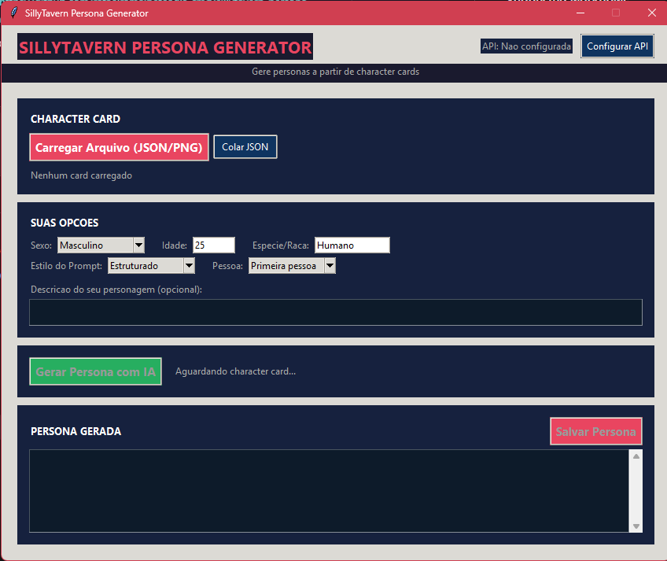

# SillyTavern Persona Generator

Generate personas from character cards for use in SillyTavern.



## Features

- **Dark theme GUI** - Modern and comfortable interface
- **Multiple AI providers** - OpenAI, Anthropic, Groq, OpenRouter, Together, DeepSeek, NVIDIA, Ollama
- **Character card support** - Load from JSON and PNG files (V2/V3)
- **4 prompt styles** - Narrative, Structured, Profile, Dialogue
- **Person options** - First person or third person perspective
- **Card-forge integration** - Automatic card validation

## Download

Choose your language:

| Language | Download |
|----------|----------|
| Português | [**Persona Generator.exe**](https://github.com/rafaelramalheteagls-cmd/sillytavern-persona-generator/releases/download/v1.0.0/Persona.Generator.exe) |
| English | [**Persona Generator EN.exe**](https://github.com/rafaelramalheteagls-cmd/sillytavern-persona-generator/releases/download/v1.0.0/Persona.Generator.EN.exe) |

## How to Use

1. Run `Persona Generator.exe` (or `Persona Generator EN.exe`)
2. Click **Configure API** and enter your API key
3. Click **Load File** and select a character card (JSON or PNG)
4. Set your options (gender, age, species, style, person)
5. Click **Generate Persona**
6. Save the generated persona

## API Configuration

The application supports multiple AI providers:

| Provider | Default URL |
|----------|-------------|
| OpenAI | api.openai.com |
| Anthropic | api.anthropic.com |
| Groq | api.groq.com |
| OpenRouter | openrouter.ai |
| Together | api.together.xyz |
| DeepSeek | api.deepseek.com |
| NVIDIA | integrate.api.nvidia.com |
| Ollama | localhost:11434 |

## Import to SillyTavern

1. Open SillyTavern
2. Click the persona icon (👤) in the top menu
3. Click "Create"
4. Import the generated JSON file
5. The persona is ready to use

## Persona Format

```json
{
  "name": "{{user}}",
  "description": "Persona description",
  "avatar": ""
}
```

## For Developers

```bash
# Install dependencies
pip install card-forge pillow pydantic

# Run Portuguese version
python persona_gui.py

# Run English version
python persona_gui_en.py

# Command line generation
python auto_persona.py character_card.json
```

## Requirements

- Python 3.8+ (for running source code)
- Windows (for executable)

## License

MIT License
